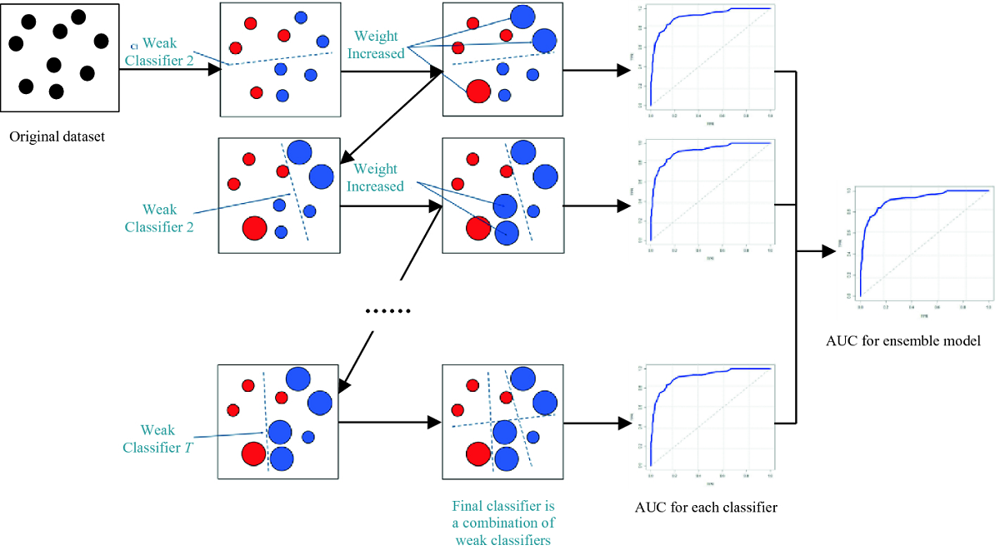
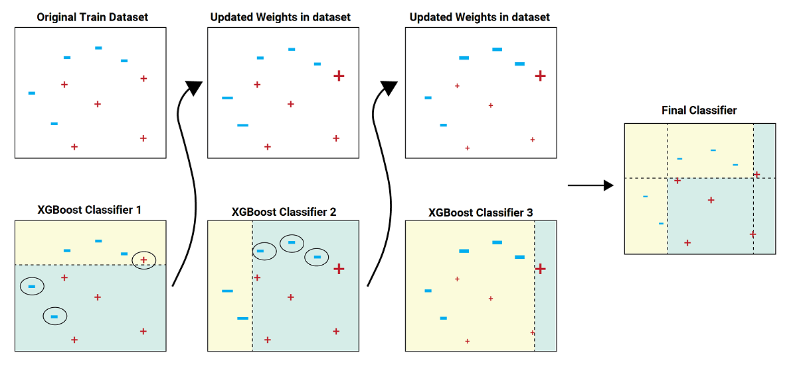

# Chapter1. Introduction to XGBoost

`XGBoost` is a powerful open-source library for regression and classification tasks. it has become widely used due to its speed, scalability, and accuracy. It is optimized for efficiency and flexibility with features such as parallel processing, tree pruning, and built-in regularization to prevent overfitting. XGBoost is compatible with Python, R, Java.

## What is Gradient boosting



Gradient boosting is a machine learning boosting technique that works on the principle that incorporating a new model into the existing ones, while considering the gradient of the loss function, would minimize the overall prediction error.

## What is XGBoost



XGBoost is a fast and flexible distributed gradient boosting library for machine learning. It implements gradient boosting algorithms for solving data science problems in a highly efficient and accurate way. XGBoost provides a parallel tree boosting, making it portable to various distributed environments such as Hadoop, SGE, and MPI. This algorithm combines decision trees to create a more precise model, making it particularly effective for weak base models. XGBoost is optimized for speed, with parallel processing and tree pruning. It also has built-in regularization and can handle missing data.

### Pros

- **High accuracy**

  The split finding algorithm uses a more efficient method than gradient boosting, which can improve training times and accuracy.

- **Speed and efficiency**

  it's optimized for speed and can use parallel processing to handle very large datasets efficiently.

- **Regularization**

  The algorithm uses L1 & L2 to regularization techniques that prevent overfitting.

- **Handling of missing data**

  Input data with missing values can be handled without manipulating data.

- **Flexibility**

  It supports both classification and regression tasks, and a wide variety of input data can be processed.

### Cons

- **Hardware requirements**

  it requires a lot of memory and processing power, especially when dealing with large datasets.

- **Sensitivity to hyperparameters**

  it has many hyperparameters that can hugely affect its performance, making it important to carefully tune these parameters for optimal results.

## Alternatives to XGBoost

### LightGBM


Developed by Microsoft, LightGBM `light gradient-boosting machine` is a free and open-source distributed gradient-boosting framework for machine learning. It is used for machine learning tasks such as ranking and classification and relies on decision tree algorithms. Its main development focus is on scalability and performance.

[LightGBM](https://lightgbm.readthedocs.io/)


### CatBoost


Developed by Yandex, CatBoost is a gradient boosting framework that is designed to handle categorical features more efficiently than other gradient boosting models. It also includes built-in support for missing values and feature scaling.

[CatBoost](https://catboost.ai/)


### RandomForest

The Random Forest Algorithm is a widely-used supervised machine learning technique that can be applied to both classification and regression problems.


### AdaBoost

it's another boosting algorithm that works by adding new models to the ensemble that corrects the errors made by previous models. It is simpler than gradient boosting and may be more interpretable.


> Overall, the choice of algorithm depends on the specific needs of the project, the characteristics of the data, and the trade-offs between factors such as accuracy, speed, and memory efficiency.s
>

## Installation

### Python

Run this code in the terminal

```bash
pip install xgboost
```

### Conda

Use Conda to install XGBoost

```bash
conda install -c conda-forge py-xgboost
```
